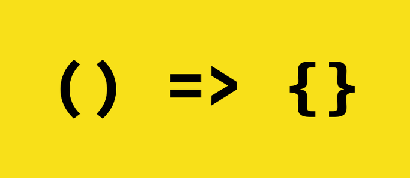
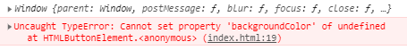

# ArrowFunction

ES6 에서는 const/let과 같이 크게 바뀐 부분 중 하나인 Arrow function (이하 arrow 함수) 입니다.

> `Arrow function`



arrow 함수는 좀 더 보기 좋고 편리합니다.

```javascript
function default(arg) {
  ...
}
```
기존의 자바스크립트에서는 이런식으로 함수를 사용하였습니다.

하지만 arrow 함수는 이와 같은 형태(=>)를 가지고 있습니다.

설명보다는 소스로 보여드리는게 빠를거 같으니 소스로 보여드리겠습니다.

```javascript
const names = ["bitbong", "blog", "javascript"];

const mapNames = names.map((item) => {
  return item + "!";
});

console.log(mapNames);
```

이런 형식으로 표현이 됩니다.

그런데 map이라는 함수를 처음 보셨을 수도 있으니, map은 우선 배열의 각각 아이템마다 함수를 호출하는 역할을 하는 기능입니다.

names 라는 배열에 map을 실행 시켜 item에 배열을 하나씩 넣어 두고, 각 값마다 !를 붙이는 함수 입니다.

map을 사용하실때는 꼭 return을 해주셔야 합니다.

---

arrow 함수는 function 표현에 완벽히 대체될 수 있을까 ?

아닙니다. let/const와 같이 완전히 대체가 될 수 없습니다.

왜냐하면 arrow함수는 특이하게도 this, arguments, super 또는 new.target을 바인딩 하지 않습니다.

또 arrow함수는 항상 익명 입니다.

메소드 함수가 아닌 곳에서 사용하기 적합합니다. 그래서 생성자로서 사용할 수 없습니다.

예를 들어 this를 가지고 설명을 하도록 하겠습니다.

```javascript
const button = document.querySelector("button");

button.addEventListener("click", function(){
  this.style.backgroundColor = "red";
})
```

html에 button이라는 녀석이 있다고 해봅시다.

우리는 보통 javascript로 버튼을 선택할때는 document.querySelector를 사용합니다.

먼저 button이라는 변수를 생성한뒤 버튼을 클릭했을때 색상을 변경해줄려고합니다.

그럼 당연히 this를 사용하여 현재 element를 가져와 색상을 바꿔 주겠죠 ?

하지만 arrow 함수를 사용하게 된다면?

```javascript
const button = document.getElementById("btn");

button.addEventListener("click", () => {
  console.log(this);
  this.style.backgroundColor = "red";
})
```



이런 에러를 내뿜게 됩니다.

this는 이제 button을 가져오고 있지 않다는 겁니다.

이런 문제들로 인해 무조건 arrow 함수를 사용하는 것은 바람직 하지 않습니다.

arrow 함수의 this는 window를 가지게 되는 겁니다.