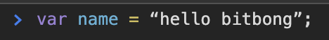
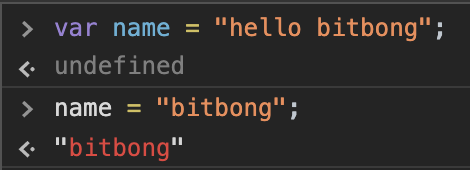
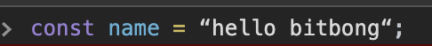
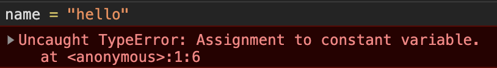
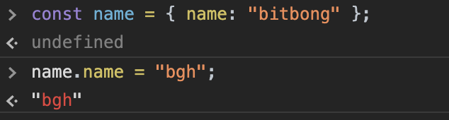
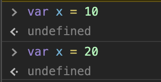
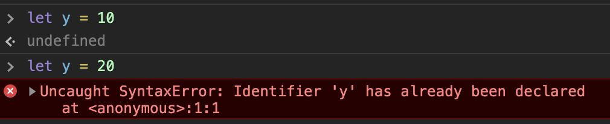

# Variables

es6로 넘어오면서 크게 달라진 점은 Variables라고 볼 수 있습니다.

기존의 자바스크립트에서는 var을 사용하였지만 es6에서부터는 let, const를 사용하는 걸 권장합니다.

> `const`

`var`로도 충분히 프로그램을 구현할 수 있겠지만, 큰 애플리케이션 / 다른 개발자들과 협업 시에는 이 문제점이 두드러지게 발생됩니다.

이런 식으로 name을 var로 사용하게 되면 애플리케이션이 커질수록 name 변수는 다른 곳에서도 사용할 가능성이 매우 높아집니다.

왜냐하면 name이라는 이름은 흔하게 사용하는 변수명이기 때문입니다.
이런 식으로 말이죠.

계속 name 변수의 value는 변하게 될 것입니다.

계속 해당 방법으로 사용해도 좋지만, 나중에 로직이 복잡해지고 커지게 되면 걷잡을 수 없는 유지 보수 지옥을 보게 될 것입니다.

그래서 es6에서 변하지 못하는 상수값을 지정해주는 `const`라는 녀석이 나오게 되었습니다.

const는 말 그대로 고정 값을 지정해줍니다.

즉, 상수라는 말이죠.

이렇게 해주게 되면 name이라는 변수는 무조건 hello bitbong 이라는 값만 가지고 있게 됩니다.

변하지도 않습니다. 만약 강제로 name 변수의 value를 변경하게 되면 콘솔에 에러가 발생하게 될 것입니다.

타입 에러가 발생하게 되면서 `const` 변수에 대한 체크를 하게 됩니다.
const 변수를 사용하게 되면 값이 변하지 않은 상수로 구현할 수 있게 됩니다.

그렇게 되면 로직이 복잡해져도, 프로그램 볼륨이 커지게 되어도, 다른 개발자들과 협업이 훨씬 쉬워지게 될 것입니다.

하지만 !

`const` 변수를 오브젝트로 생성한 뒤

오브젝트의 값을 변경하게 되면 값이 변경됩니다.

그러니 const를 사용하실 때는 잘 생각하고 사용을 하셔야 합니다.

> `let`

`let`은 const 보다 간단합니다.

`let`은 값을 변경할 수 있습니다 !

그럼 var과 뭐가 다르냐고요 ?

var과 `let`의 큰 차이점은 overwrite를 막아 준다는 겁니다.

var을 사용할 시에는 overwrite를 허용하는 모습을 볼 수 있습니다.

하지만

let을 사용할 시에는 overwrite가 막혀져 있는 모습을 볼 수 있습니다.

이미 y가 사용되고 있다는 에러입니다.

저 같은 경우에는 웬만해서는 const를 우선 사용하는 것을 권장합니다.

하지만 지속적인 값을 변경할 경우에는 let을 사용하는 것을 추천합니다.